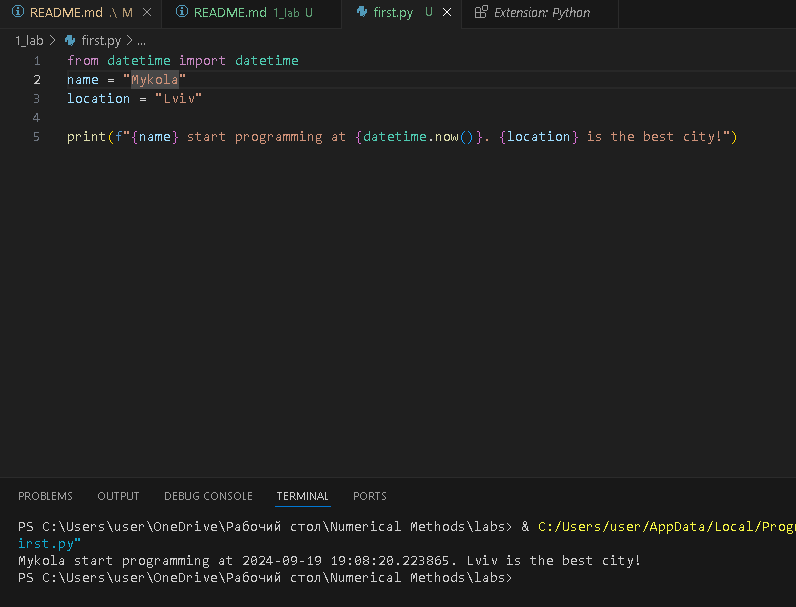
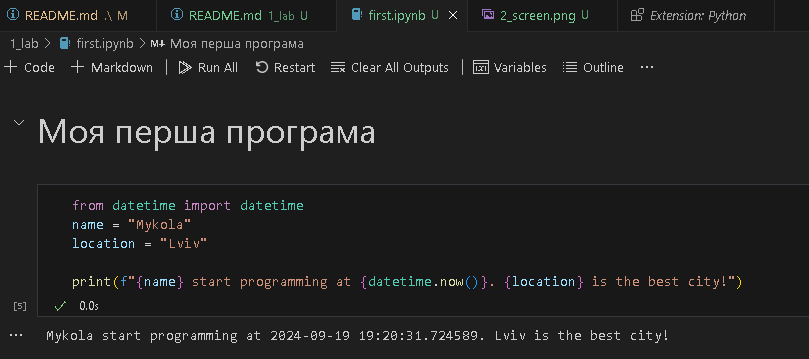
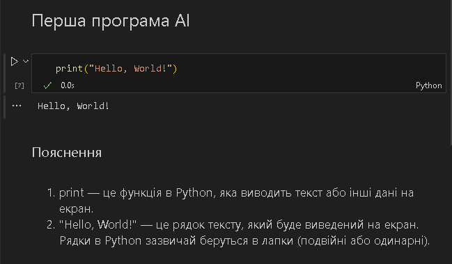

# Звіт до роботи 1
## Тема: Вступ
### Мета роботи: налаштувати середовище, створити репозиторій, попрацювати з Markdown та оформити звіт

---
### Виконання роботи
* Результати виконання завдань:
    1. Репозиторій створено, [посилання на нього](https://github.com/CMAYKL/labs?tab=readme-ov-file&authuser=2#labs);
    1. Навчились працювати з репозиторієм та налаштували інтеграцію з Visual Studio Code;
    1. Написали першу програму та запустили її. Програма вивела текст представлений на скріншоті:
    
    1. Створили Пайтон Ноутбук та виконали тестову програму в ньому. Програма надрукувала те що представлено на скріншоті:
    
    1. Навчились працювати з Пайтоном, запускати програми та оформлювати звіти;

* Результат що нам видав ChatGPT:

   

---
### Висновок:

- :question: Що зроблено в роботі;
    1. Створено репозиторій на GitHub та налаштовано інтеграцію з Visual Studio Code.
    2. Написана та запущена перша програма, що виводить текст.
    3. Створено та протестовано Python Ноутбук, у якому виконано тестову програму.
    4. Набуто базові навички роботи з Python, репозиторіями та звітами.
- :question: Чи досягнуто мети роботи;
    1. Так, мета роботи досягнута. Всі необхідні завдання виконано.
- :question: Які нові знання отримано;
    1. Отримано знання щодо налаштування та роботи з репозиторіями на GitHub.
    2. Освоєно базові інструменти Python та середовище Visual Studio Code для розробки.
- :question: Чи вдалось відповісти на всі питання задані в ході роботи;
    1. Так, всі питання, що виникали в ході роботи, були вирішені.
- :question: Чи вдалося виконати всі завдання;
    1. Так, всі завдання виконано успішно.
- :question: Чи виникли складності у виконанні завдання;
    1. Складнощів не виникло. 
- :question: Чи подобається такий формат здачі роботи (Feedback);
    1. Формат здачі роботи є зручним.
- :question: Побажання для покращення (Suggestions);
    1. Поки ніяких побажань немає, все супер.

---