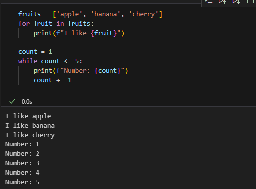
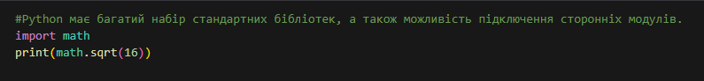

# Звіт до роботи 2
## Тема: Основи Python
### Мета роботи: Ознайомитись на начитись використовувати основні елементи мови програмування Python, виконати приклади та за допомогою ChatGPT навчитись створювати промпти для генерації коду.

---
### Виконання роботи
* Результати виконання завдань:
    1. Познайомився з основними типами даних. Попракитикувався з простими змінними str та int, списками list, наборами set та словниками dict:      
    
    2. Вивів вбудовані константи:     
    
    3. Вивів результат роботи вбудованих функцій:     
    
    4. Познайомився з циклами. Код який демонструє роботу циклів:    
    
    5. Познайомився з розгалуженнями. Код який демонструє роботу розгалужень:    
    
    6. Конструкція try->except->finally. У мові Python код не компілюється, а виконується відразу. Можливі помилки нам треба виловлювати самим.     
    
    7. Контекст-менеджер with. Код з контекст-менеджером:     
    
    8. Познайомився з Python lambdas. Лямбди — це анонімні функції, які можуть мати будь-яку кількість аргументів, але обмежуються одним виразом. Приклад коду:        
    
    

* Результат що нам видав ChatGPT про основи python:
1. Основи синтаксису
- Коментарі:   

- Змінні та типи даних:  

2. Структури даних 

3. Контроль виконання 

4. Функції 

5. Обробка виключень   

6. Модулі та бібліотеки 

7. Основи об'єктно-орієнтованого програмування (ООП) 

---
### Висновок:

- :question: Що зроблено в роботі;
1. Познайомився з основними типами даних. Попрактикувався з простими змінними str та int, списками list, наборами set та словниками dict:
2. Вивів вбудовані константи:
3. Вивів результат роботи вбудованих функцій:
4. Познайомився з циклами та з розгалуженнями.
5. Познайомився з конструкцією try->except->finally. 
6. Познайомився з контекст-менеджер with. 
7. Познайомився з Python lambdas. 
- :question: Чи досягнуто мети роботи;
    1. Так, мета роботи досягнута. Всі необхідні завдання виконано.
- :question: Чи вдалось відповісти на всі питання задані в ході роботи;
    1. Так, всі питання, що виникали в ході роботи, були вирішені.
- :question: Чи вдалося виконати всі завдання;
    1. Так, всі завдання виконано успішно.
- :question: Чи виникли складності у виконанні завдання;
    1. Складнощів не виникло. 
- :question: Чи подобається такий формат здачі роботи (Feedback);
    1. Формат здачі роботи є зручним.
- :question: Побажання для покращення (Suggestions);
    1. Поки ніяких побажань немає, все супер.

---